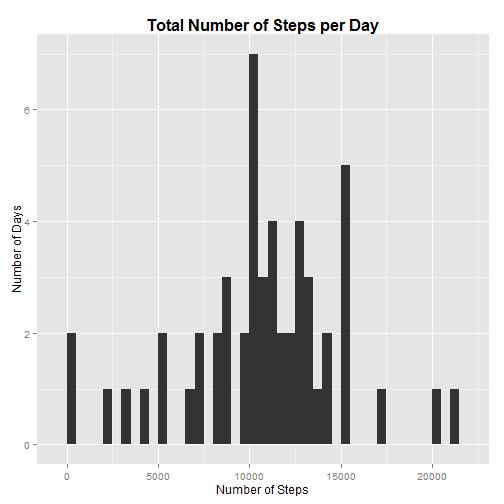
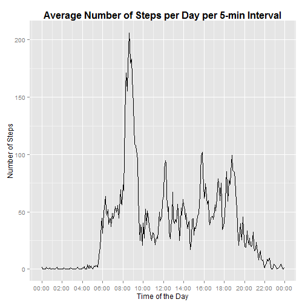
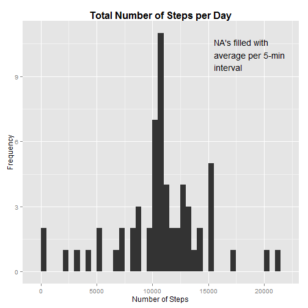
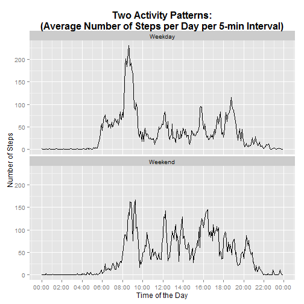

The assignment uses the data from the personal activity monitoring device. The device collects number of steps of anonymous individual at 5 minute intervals during October and November 2012.


## Loading and preprocessing the data


```r
pa_url <- "http://d396qusza40orc.cloudfront.net/repdata/data/activity.zip"
pa_localfile = "activity.zip"

if (!file.exists(pa_localfile)) {
  download.file(pa_url, destfile = pa_localfile) 
}
```

### Unzip the data.

```r
if (! dir.exists("./data")) { dir.create("./data")}
unzip(pa_localfile, exdir="data", overwrite=TRUE)
list.files("./data")
```

```
## [1] "activity.csv"
```

### Load the necessary libraries, setting locale.


```r
library(lubridate)
library(dplyr)
library(ggplot2)
library(scales)
library(magrittr)
Sys.setlocale(category = "LC_ALL", locale = "English")
```

```
## [1] "LC_COLLATE=English_United States.1252;LC_CTYPE=English_United States.1252;LC_MONETARY=English_United States.1252;LC_NUMERIC=C;LC_TIME=English_United States.1252"
```

### Load the data in R.
The field "steps" is integer.

The "date" column is read as character, then parsed with lubridate's `parse_date_time`.

The identifiers in the "interval" columns are actually set of hours (except hour 0) and minutes, we will format them accordingly. 


```r
data<-read.csv("./data/activity.csv",
               colClasses=c("integer", "character", "integer"))

data$date<-parse_date_time(data$date, "%Y-%m-%d")

data$interval<-sprintf("%04d", data$interval)
data$interval<-gsub('^([0-9]{2})([0-9]{2})$', '\\1:\\2', data$interval)

head(data)
```

```
##   steps       date interval
## 1    NA 2012-10-01    00:00
## 2    NA 2012-10-01    00:05
## 3    NA 2012-10-01    00:10
## 4    NA 2012-10-01    00:15
## 5    NA 2012-10-01    00:20
## 6    NA 2012-10-01    00:25
```

There are some **missing values**. We exclude these records in the first part of the assignment as required.


```r
data_1<-data[complete.cases(data),]
str(data_1)
```

```
## 'data.frame':	15264 obs. of  3 variables:
##  $ steps   : int  0 0 0 0 0 0 0 0 0 0 ...
##  $ date    : POSIXct, format: "2012-10-02" "2012-10-02" ...
##  $ interval: chr  "00:00" "00:05" "00:10" "00:15" ...
```


## What is mean total number of steps taken per day?

We group the sums of steps per day, then plot the histogramm.

We report the mean and the median of the steps per day as well.


```r
day_sums<-
  data_1 %>%
  group_by(date) %>%
  select(date, steps) %>%
  summarise(
    steps.sum = sum(steps, na.rm=TRUE)
  )

hist_1<-
  ggplot(day_sums, aes(steps.sum)) + geom_histogram(binwidth = 500) +
  labs(list(
    title = "Total Number of Steps per Day",
    x = "Number of Steps",
    y = "Number of Days")) +
  theme(plot.title  =  element_text(size  =  16,  face  =  "bold"))

hist_1
```

 

```r
(steps.mean.1<-mean(day_sums$steps.sum))
```

```
## [1] 10766.19
```

```r
(steps.med.1 <-median(day_sums$steps.sum))
```

```
## [1] 10765
```

The mean total number of steps per day is 10766.19, the median is 10765 steps.


## What is the average daily activity pattern?

We group the data by interval now.

Since these are **time** intervals, it makes sense to convert them into the time objects. This makes the plots looking clearer. It is important to add the attribute "tzone" == "UTC", otherwise there is a human-read difference of 1 hour between interval as character string and interval as time object (in my environment).


```r
interval_sums<-

    
  data_1 %>%
  group_by(interval) %>%
  select(interval, steps) %>%
  summarise(
    steps.sum = mean(steps, na.rm=TRUE) 
  )

to_dt<-function(x) {return (parse_date_time(x,"%H:%M") )}


interval_sums<-
  interval_sums %>%
  mutate(
    my.time = as.numeric(to_dt(interval) - trunc(to_dt(interval), "days")))
class(interval_sums$my.time) <- "POSIXct"
attr(interval_sums$my.time, "tzone")<- "UTC"

ts_1<-
  ggplot(interval_sums, 
         aes(x=my.time,
             y=steps.sum)) +
  geom_line() +
  scale_x_datetime(labels = date_format("%H:%M"),
                   breaks = date_breaks("2 hours")) +
  labs(list(
    title = "Average Number of Steps per Day per 5-min Interval",
    x = "Time of the Day",
    y = "Number of Steps")) +
  theme(plot.title  =  element_text(size  =  16,  face  =  "bold"))
ts_1
```

 

Which 5-minute interval, on average across all the days in the dataset,
contains the maximum number of steps?


```r
(int.max.steps<-filter(interval_sums, steps.sum == max(steps.sum))$interval)
```

```
## [1] "08:35"
```

It is the interval at 08:35, which seems plausible. 

## Imputing missing values


```r
any(is.na(data[,-1]))
```

```
## [1] FALSE
```

```r
any(is.na(data[, 1]))
```

```
## [1] TRUE
```

```r
dim(data[! complete.cases(data),])[1]
```

```
## [1] 2304
```

Are the missing values in the first column only? Yes.

How many do we have? 2304.

### Filling in all of the missing values in the dataset.

We have the mean steps per 5-min. interval already. So let us use those values for the 5-min. intervals with missing values.


```r
data %>%
  left_join(interval_sums, by="interval") %>%
  mutate(steps = ifelse(is.na(steps),
                        as.integer(steps.sum),
                        steps)
         )-> data_2
data_2<-select(data_2,steps, date, interval)
```

Again we group the sums of steps per day and then plot the histogramm.


```r
day_sums_2<-
  data_2 %>%
  group_by(date) %>%
  select(date, steps) %>%
  summarise(
    steps.sum = sum(steps, na.rm=TRUE)
  )

hist_2<-
  ggplot(day_sums_2, aes(steps.sum)) + geom_histogram(binwidth = 500) +
  labs(list(
    title = "Total Number of Steps per Day",
    x = "Number of Steps",
    y = "Frequency")) +
  theme(plot.title  =  element_text(size  =  16,  face  =  "bold")) +
  annotate("text", x = 15500, y=10, 
           label="NA's filled with\naverage per 5-min\ninterval",
           hjust=0)

hist_2
```

 


What are the mean and median total number of steps taken per day now?


```r
(steps.mean.2<-mean(day_sums_2$steps.sum))
```

```
## [1] 10749.77
```

```r
(steps.med.2 <-median(day_sums_2$steps.sum))
```

```
## [1] 10641
```


Do these values differ from the estimates from the first part of the assignment? Yes, they do.


What is the impact of imputing missing data on the estimates of the total
daily number of steps? We'll define impact as the change in % to the first value. The `percent` function is from the *scales* library.


```r
impact<- function(x,y) { return(percent((x-y)/y)) } 
impact(steps.mean.2,steps.mean.1)
```

```
## [1] "-0.152%"
```

```r
impact(steps.med.2,steps.med.1)
```

```
## [1] "-1.15%"
```


## Are there differences in activity patterns between weekdays and weekends?

We create a wd (weekday) column for weekdays or weekends (wday function from *lubridate* is used for that), then group by wd and 5-min. intervals. The 5-min. intervals are again converted into time objects in the same way as above.


```r
interval_sums_2<-
  data_2 %>%
  mutate(
    wd = ifelse(wday(date)==1 | wday(date)==7, 'Weekend', 'Weekday')
  ) %>%
  group_by(wd, interval) %>%
  select(interval, steps, wd) %>%
  summarise(
    steps.sum = mean(steps, na.rm=TRUE) # sum(steps, na.rm=TRUE) / num.days
  )

interval_sums_2<-
  interval_sums_2 %>%
  mutate(
    my.time = as.numeric(to_dt(interval) - trunc(to_dt(interval), "days")))
class(interval_sums_2$my.time) <- "POSIXct"
attr(interval_sums_2$my.time, "tzone")<- "UTC"
```

Now we make a panel plot of daily activity in steps per 5-min. interval on weekdays and weekends.


```r
ts_2<-
  ggplot(interval_sums_2, 
         aes(x=my.time,
             y=steps.sum)) +
  facet_wrap(~ wd, nrow=2) +
  geom_line() +
  scale_x_datetime(labels = date_format("%H:%M"),
                   breaks = date_breaks("2 hours")) +
  labs(list(
    title = "Two Activity Patterns:\n(Average Number of Steps per Day per 5-min Interval)",
    x = "Time of the Day",
    y = "Number of Steps")) +
  theme(plot.title  =  element_text(size  =  16,  face  =  "bold"))
ts_2
```

 

One has different activites on weekdays and weekdays indeed. 

## The environment.


```r
sessionInfo()
```

```
## R version 3.2.1 (2015-06-18)
## Platform: i386-w64-mingw32/i386 (32-bit)
## Running under: Windows 7 (build 7601) Service Pack 1
## 
## locale:
## [1] LC_COLLATE=English_United States.1252 
## [2] LC_CTYPE=English_United States.1252   
## [3] LC_MONETARY=English_United States.1252
## [4] LC_NUMERIC=C                          
## [5] LC_TIME=English_United States.1252    
## 
## attached base packages:
## [1] stats     graphics  grDevices utils     datasets  methods   base     
## 
## other attached packages:
## [1] magrittr_1.5    scales_0.2.5    ggplot2_1.0.1   dplyr_0.4.2    
## [5] lubridate_1.3.3 knitr_1.10.5   
## 
## loaded via a namespace (and not attached):
##  [1] Rcpp_0.11.6      MASS_7.3-41      munsell_0.4.2    colorspace_1.2-6
##  [5] R6_2.0.1         stringr_1.0.0    plyr_1.8.3       tools_3.2.0     
##  [9] parallel_3.2.0   grid_3.2.0       gtable_0.1.2     DBI_0.3.1       
## [13] htmltools_0.2.6  yaml_2.1.13      lazyeval_0.1.10  assertthat_0.1  
## [17] digest_0.6.8     reshape2_1.4.1   formatR_1.2      mime_0.3        
## [21] memoise_0.2.1    evaluate_0.7     rmarkdown_0.7    labeling_0.3    
## [25] stringi_0.5-2    markdown_0.7.7   proto_0.3-10
```
